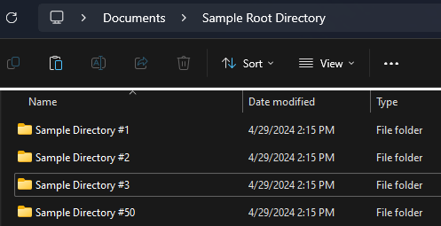
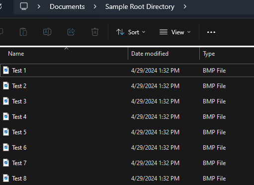

# psUnpacker
## A simple, specific tool for a simple, specific problem.
---
### Purpose
This tool solves one specific problem I have encountered in my personal endeavors:
- I have a large amount of folders containing various files
- I need all of these files to be moved into one directory, then delete the leftover empty folders
- *How do I do that without spending hours manually moving files and deleting folders?*

**Before**

**After:**

---
### Usage
1. Move all of your folders into the destination directory
2. Place psUnpacker.py in the destination directory
3. Run psUnpacker.py

All of the files will be moved and the leftover empty folders will be deleted.
Feel free to move or delete psUnpacker.py afterwards.